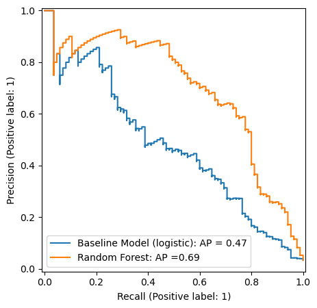
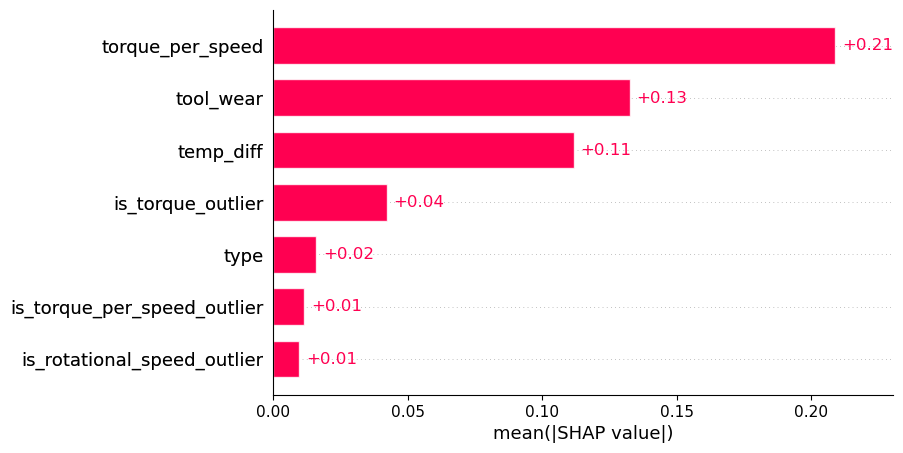
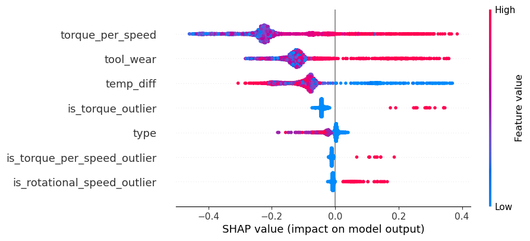
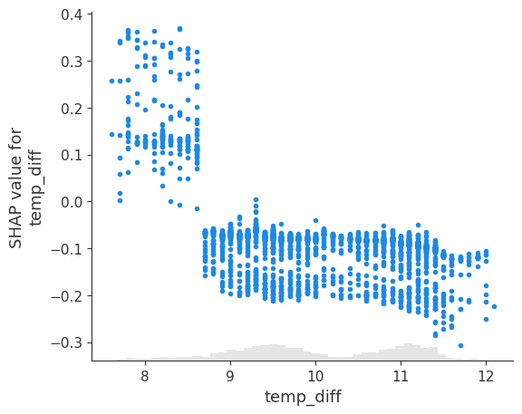
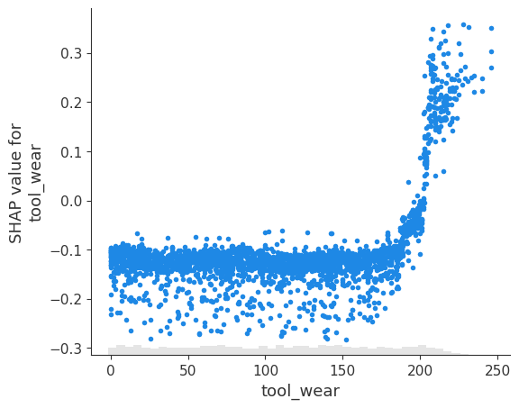
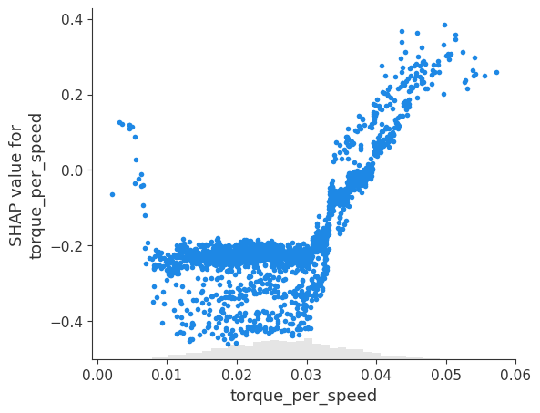

# Predictive-Maintenance-Project
This project develops a predictive maintenance model to identify early signs of machine failure using sensor data from industrial equipment. The workflow includes data exploration and cleansing, feature engineering, and model development with both logistic regression and Random Forest classifiers. Model interpretability is achieved through SHAP analysis, which provides insights into how features influence model predictions. The Random Forest model demonstrates strong performance in detecting potential failures and serves as an effective early warning system to support proactive maintenance and reduce operational downtime.

## Objective
The objective of this project is to develop a predictive maintenance model that can identify early warning signs of machine failure using sensor data. The goal is to enable proactive maintenance decisions that reduce downtime and operational costs. The project also includes interpretability analysis (SHAP analysis) to understand feature importance.

## Data Source
Dataset: "AI4I 2020 Predictive Maintenance Dataset" - licensed under Creative Commons Attribution 4.0 International (CC BY 4.0) by UCI Machine Learning Repository.  
Used solely for educational and non-commercial purposes.  
Dataset available at: https://archive.ics.uci.edu/ml/datasets/ai4i+2020+predictive+maintenance+dataset

## Notebook Structure
The analysis in `notebook/Predictive_Maintenance_Project.ipynb` is organized into the following sections:
1. **Exploratory Data Analysis** - Explore and clean maintenance data, identify missing values, detect outliers, analyze correlations and examine class distribution.
2. **Data Preprocessing** - Handle outliers, encode categorical variables, create new variables to address multicollinearity and prepare data for modeling.
3. **Model Development** - Split the data using stratified sampling and scale key features, tune model hyperparameters using Stratified Cross-Validation with RandomizedSearchCV, build and evaluate baseline logistic regression model and Random Forest classifier.
4. **SHAP Analysis** - Interpret model predictions using SHAP values to understand feature contributions and generate model-informed maintenance insights.

## Packages
The following python packages were used in this project:
- NumPy
- pandas
- Matplotlib
- seaborn
- scikit-learn
- SHAP

## Process
- Conduct exploratory data analysis (EDA) and feature engineering on sensor readings using Python (NumPy, pandas, Matplotlib, Seaborn, scikit-learn).
- Improved model reliability on imbalanced dataset through stratified sampling and evaluated an optimized Random Forest model against a baseline logistic regression model.
- Applied hyperparameter tuning and evaluated models with Precision-Recall AP to optimize minority class detection.
- Performed SHAP analysis to identify influential predictors and generate actionable insights for predictive maintenance.

## Recommendation
The SHAP analysis identifies features that were most influential in the model’s predictions rather than causal factors of machine failure. Therefore, the following recommendations are model-informed insights that should be validated with engineering expertise and further operational analysis.

**Operational Recommendations**
- Torque per speed - The model consistently associates high torque per speed ratios with predicted failures, though occasional failures are also linked to low ratios. This suggests that machines operating under unusually high or low torque per speed may warrant closer monitoring or earlier inspection to prevent potential issues.
- Tool wear – Predictions indicate that higher tool wear levels are linked to elevated failure probability. Defining and monitoring wear thresholds could help trigger timely maintenance actions, subject to validation with physical wear data.
- Temperature difference – The model tends to flag lower differences between process and air temperature as risk conditions. This pattern may suggest that insufficient thermal dissipation or abnormal heat buildup contributes to failure risk, warranting further review.
- Outlier flags – Occasional positive SHAP contributions from outlier indicators suggest that extreme or rare sensor readings can influence failure predictions. These cases may merit deeper diagnostic checks to confirm whether they reflect genuine anomalies or sensor noise.

**Analytical Recommendations**
- Collaborate with domain experts to verify whether the model’s identified relationships align with known mechanical principles.
- Consider incorporating time-dependent features (e.g., rate of change in tool wear or torque) in future iterations to better capture gradual degradation patterns.
- Use the Random Forest model primarily as an early warning system to flag high-risk operating conditions for preventive inspection, rather than as a definitive diagnostic tool.

## Visualizations

   
  <em>Figure 1. Precision-Recall curve of logistic regression model and Random Forest classifier.</em>

 

  
  
  <em>Figure 2. Left: SHAP bar plot illustrating the relative importance of each feature in the model’s predictions. Right: SHAP beeswarm plot showing how feature values influence the likelihood of machine failure.</em>

 

  
  
  
  <em>Figure 3. SHAP scatter plot for temp_diff (left), tool_wear (middle), torque_per_speed (right) showing how variations in feature values affect their contribution and direction of influence on model predictions.</em>

## Limitation
- The Random Forest model is trained on static sensor data, which limits its ability to capture time-dependent degradation trends or evolving machine conditions.
- The SHAP analysis interprets model behavior but does not establish causal relationships in real-world machine dynamics.
- Validation with domain experts and testing on live production data are necessary to confirm model reliability before any operational use.
